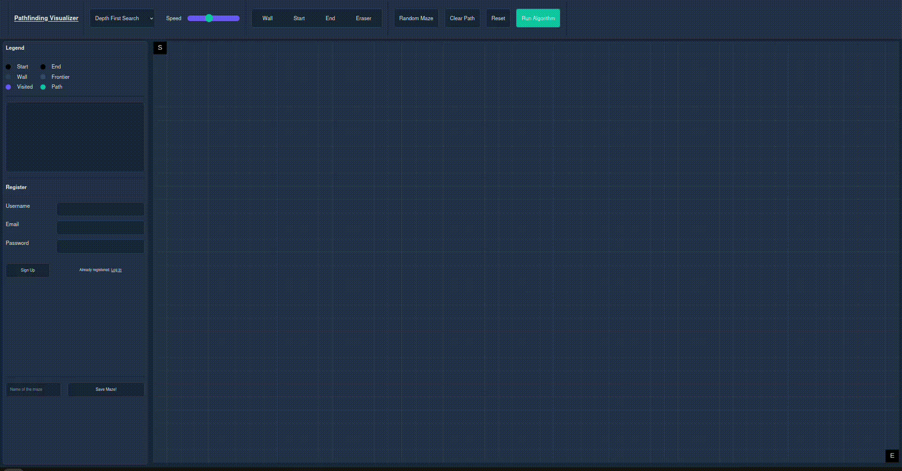

This is a simple version of a pathfinding visualizer, it implements 3 algorithms, DFS, BFS and A*. Here you have the official version of the guide you can also consult on the page and some interesting implementation details.

## USAGE

1. Run a local PHP + MySQL environment (e.g. XAMPP/LAMP/MAMP).
2. Create a MySQL database named **`pweb_db`**.
3. Import the SQL file.
4. Update `php/dbaccess.php` with your DB credentials if needed.
5. Start Apache & MySQL, then open: http://localhost/your-project-folder/

---

## DEMO

#### LOGIN and SAVING BOARDS

---

# GUIDE TO PATHFINDING VISUALIZER

A Pathfinding Visualizer allows the user to see some "search algorithms" in action on a grid. In this case you will have the possibility to visualize three algorithms: Depth First Search, Breadth First Search, and A*.

## Setting up
As a first step you should set up the Start and the End of the search, you can do so by clicking on the respective element on the toolbar and then by clicking the position you wanna set it to. Now it is time to set the walls, you can do it both by using the random maze (in this case for a path to exist between the two you must set the start and the end first) and setting the walls by hand (note that after you select the Wall element, once you click on the canvas, if you hold the click and slide walls will still be placed). You can also remove walls with the Eraser element.

## Running the algorithm
Now you can eventually select the algorithm and the speed on the toolbar, once you have done this you can run the algorithm with the button on the top right. You will see an animation on the canvas showing each step of the search. Once the path is found some information will be added on the log under the legend.

## Reverting the state of the maze
Once you finished the run, you have the following options:
- Clearing the path and the visited cells with the dedicated button and run another algorithm.
- Resetting the board with the dedicated button.
- Change the current board as you prefer.

## Signing up
You can sign up and save your favorite mazes on your profile and then load it whenever you want. Note that saving a board won't save the positions of the start and the end but only the maze.

--- 

## Some implementation details
My initial idea for the random maze generator was to generate a random path before generating the maze, the problem was that the random path often covered almost the entire board. So i decided to generate mazes and immediately check if a path existed between start and end. Doing a Montecarlo simulation i found out that this method, with the parameters i set requires 2 generations of the maze on average.

#### Algorithms implemented
- DFS: the most common graph searching algorithm, it simply visits the current node and runs recursively in all the other directions, in this case the order of the directions is fixed, one could also implement it randomizing the directions. Time complexity: O(n). Space complexity: O(n).
- BFS: the bfs computes the shortest path from the start to each cell by spreading each iteration from one of the visited cells with the shortest distance from the start. Time complexity: O(n). Space complexity: O(n).
- A*: this algorithm works as Dijkstra's algorithm but by using an heuristic: the next node, instead of being the one with the current shortest distance (between the not fully visited ones), will be the one with the shortest "distance + (manhattan distance from the end point)". In this way we avoid paths that spread to far from the end point we want to reach. Note that differently from the other two algorithms, we are using the final position as an information, in this sense the algorithm is said to be informed. Time complexity: O(n2). Space complexity: O(n).
The n in the complexities refers to the total number of cells.

## Possible improvements
- Adding some default mazes (i saw on a site a recursive maze that was really cool)
- Adding some algorithms